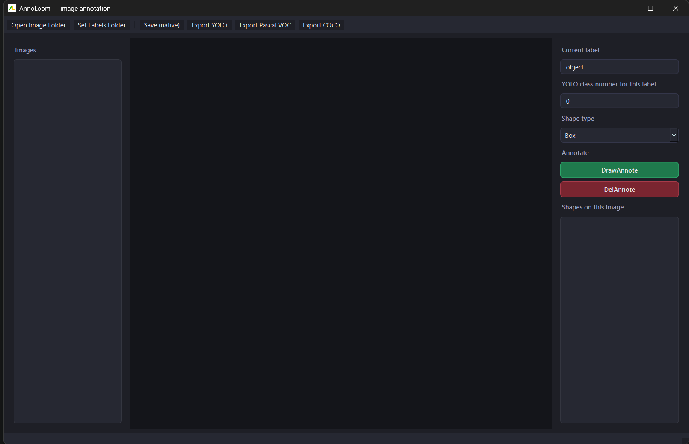
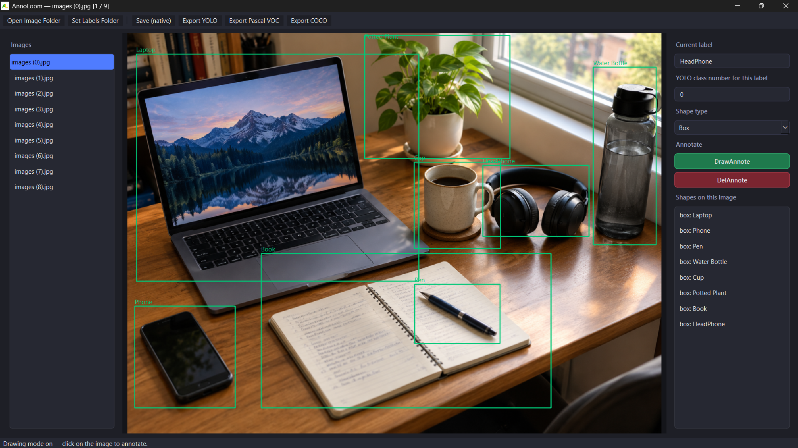

<div align="center">


# AnnoLoom

**A modern desktop image annotation tool for computer vision datasets**

Bounding boxes, polygons, and keypoints — in one clean PyQt6 app.

[](LICENSE)
[](https://www.python.org/)
[](https://pypi.org/project/PyQt6/)

</div>

---

## Install

```bash
pip install annoloom
```

## Run

```bash
annoloom
```

Then Open Folder and point it at a directory of images. Draw boxes,
polygons, or keypoint sets, assign labels, and save.

## AnnoLoom UI



## AnnoLoom Annotation Marking



## Features

- **Three shape types**: bounding boxes, polygons, and labeled keypoints
  (with optional skeleton connections for pose-style annotation).
- **Undo / Redo**: Ctrl+Z to undo, Ctrl+Shift+Z to redo — up to 50 steps.
- **Zoom in / Zoom out**: Ctrl+Scroll wheel, or toolbar buttons.
  Zoom to Fit with Ctrl+0.
- **Keyboard shortcuts**:
  - `A` / `D` — previous / next image
  - `B` — switch to Box tool
  - `P` — switch to Polygon tool
  - `K` — switch to Keypoints tool
  - `Enter` — finish polygon or keypoints
  - `Delete` — delete the selected shape
  - `Escape` — cancel in-progress shape
  - `Ctrl+S` — save
  - `Ctrl+Z` / `Ctrl+Shift+Z` — undo / redo
- **Auto-save**: annotations are saved automatically when you switch
  to the next image — no more lost work from forgetting Ctrl+S.
- **Annotation count**: the shape panel header shows how many shapes
  are on the current image, e.g. "Shapes on this image (3)".
- **Dark / Light theme toggle**: switch between dark and light UI
  from the toolbar.
- **Dataset Statistics**: one-click summary — total images, annotated
  vs unannotated count, total annotations, and per-class breakdown.
- **DrawAnnote / DelAnnote workflow**: click DrawAnnote, draw a shape,
  it auto-finishes; select a shape in the list and click DelAnnote
  (or press Delete) to remove it.
- **White crosshair guide lines** follow your cursor while drawing,
  to help line up box edges precisely.
- **Auto-fit, centered canvas**: images scale to fill the available
  space and stay centered.
- **Natural, numeric image ordering**: files like `img2.jpg`, `img10.jpg`,
  `img100.jpg` are listed in true numeric order.
- **`[current / total]` counter** in the title bar, e.g. `[3 / 500]`.
- **Custom YOLO class numbers**: pin any number to a label for YOLO export.
- **Big, unmissable "✓ Labels saved successfully" banner** on every save.
- **Native save format** (`<image>.aloom.json`): lossless.
- **Export formats**:
  - YOLO (`.txt`, normalized box coordinates, custom class numbers)
  - Pascal VOC (`.xml`)
  - COCO (`.json`, supports boxes, polygon segmentations, and keypoints)
- **No default "object" class**: the label field starts empty so you
  type only the classes you actually need — no stray "object" category
  appearing in your exports.

## Keyboard Shortcut Reference

| Key | Action |
|-----|--------|
| `A` | Previous image |
| `D` | Next image |
| `B` | Box tool |
| `P` | Polygon tool |
| `K` | Keypoints tool |
| `Enter` | Finish polygon / keypoints |
| `Delete` | Delete selected shape |
| `Escape` | Cancel drawing |
| `Ctrl+S` | Save |
| `Ctrl+Z` | Undo |
| `Ctrl+Shift+Z` | Redo |
| `Ctrl+=` | Zoom in |
| `Ctrl+-` | Zoom out |
| `Ctrl+0` | Zoom to fit |
| `Ctrl+Scroll` | Zoom in / out |

## Data model

Internally every shape is stored in a small dataclass model
(`annoloom.core.shapes`) at full float precision in image-pixel space.

## Development

```bash
git clone https://github.com/Hakai99/ANNOLOOM
cd annoloom
pip install -e .
python -m annoloom.app
```

## Building a standalone .exe (Windows)

```
build_exe.bat
```

This installs PyInstaller if needed and builds using `AnnoLoom.spec`.
Your executable will be at `dist\AnnoLoom.exe`.

## License (OpenHands)

This project is licensed under a custom license — free to use, but
modification and redistribution of modified versions are not permitted.
See the [LICENSE](LICENSE) file for full terms.
